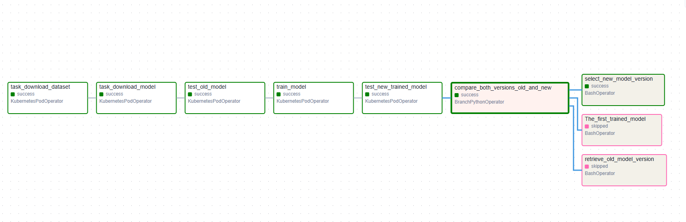

# Room Occupancy Prediction with MLOps

This repository demonstrates an end-to-end MLOps implementation for room occupancy prediction using XGBoost algorithm. The project includes model training, containerized deployment, and automated CI/CD pipelines.

## Project Overview

The system predicts room occupancy based on various sensor data inputs using XGBoost algorithm. The implementation follows:
- Containerized training and serving environments
- FastAPI-based model endpoint
- Automated CI/CD pipeline using GitHub Actions
- Docker container registry integration
- DVC-based data versioning and ML pipelines
- Airflow orchestration for automated ML task

## Repository Structure

```
.
├── occupancy.py  # Training pipeline implementation       
├── inference_server.py # FastAPI model endpoint           
├── Dockerfile.training    # Docker configuration for training
├── Dockerfile.server      # Docker configuration for model serving
├── Dockerfile.data_versioning      # Docker configuration for dvc
├── dvc_pull.sh     # Script for dvc operation to manage datasets and models
├── .github/
│   └── workflows/
│       └── ci-cd.yml      # CI/CD pipeline configuration
└── README.md
```

## Getting Started

### Prerequisites

- Docker
- Python 3.8+

### Local Development

1. Clone the repository:
```bash
git clone https://github.com/MISSEY/ML_Case_Study.git
cd ML_Case_Study
```

2. Build and run the training container:
```bash
docker build -t training-pipeline -f Dockerfile.training .
docker run --mount type=bind,source="<occupancy_data>",target=/ml_pipeline/occupancy_data --mount type=bind,source="<models>",target=/ml_pipeline/models training-pipeline 
```

3. Build and run the prediction server:
```bash
docker build -t prediction-server -f Dockerfile.server .
docker run --mount type=bind,source="<occupancy_data>",target=/ml_pipeline/occupancy_data --mount type=bind,source="<models>",target=/ml_pipeline/models -p 8000:8000 prediction-server
```

### API Usage

Once the prediction server is running, you can make predictions using the following endpoint:

```python
import requests

data = {
    "timestamp": "2024-02-04T10:30:00",
    "temperature": 23.5,
    "humidity": 45.2,
    "light": 450,
    "co2": 800,
    "humidity_ratio": 0.005
}

response = requests.post("http://localhost:8000/predict", json=data)
print(response.json())
```

## CI/CD Pipeline

The project includes an automated CI/CD pipeline implemented with GitHub Actions that:

1. **Training Pipeline**:
   - Builds the training container
   - Pushes to Docker Hub registry (on main branch)

2. **Prediction Server**:
   - Builds the prediction server container
   - Pushes to Docker Hub registry (on main branch)

### Pipeline Configuration

The pipeline is triggered on:
- Push to main branch
- Pull requests to main branch

To use the CI/CD pipeline, set up the following secrets in your GitHub repository:
- `DOCKER_USERNAME`: Your Docker Hub username
- `DOCKER_PASSWORD`: Your Docker Hub password/token

## Docker Images

The project produces two Docker images:
1. `smishra03/occupancy-training:latest` - Training pipeline
2. `smishra03/occupancy-service:latest` - Prediction server


## MLOps 

### Data Version Control (DVC)

DVC usually runs along with Git. Git is used as usual to store and version code (including DVC meta-files). 
DVC helps to store data and model files seamlessly out of Git, while preserving almost the same user experience as if 
they were stored in Git itself. [Follow this link to know more](https://github.com/iterative/dvc#how-dvc-works)

#### Dataset and saved model version control

`git checkout` and `dvc checkout` commands are used together to restore the corresponding versions of the DVC-tracked data files and directories from the cache to the workspace.
`dvc checkout` must be executed after `git checkout` because, git controls the version of .dvc files and dvc works on top of git.
````
git checkout <commit-tag>
dvc checkout <file name>
````

### Airflow DAG Structure

An Airflow DAG (Directed Acyclic Graph) is a way of organizing tasks and defining relationships between them.
Relationships refer to how a certain task is associated with the previous and subsequent tasks in a pipeline.
For a better understanding of DAGs, refer to the [official tutorial](https://airflow.apache.org/docs/apache-airflow/stable/tutorial/index.html).



